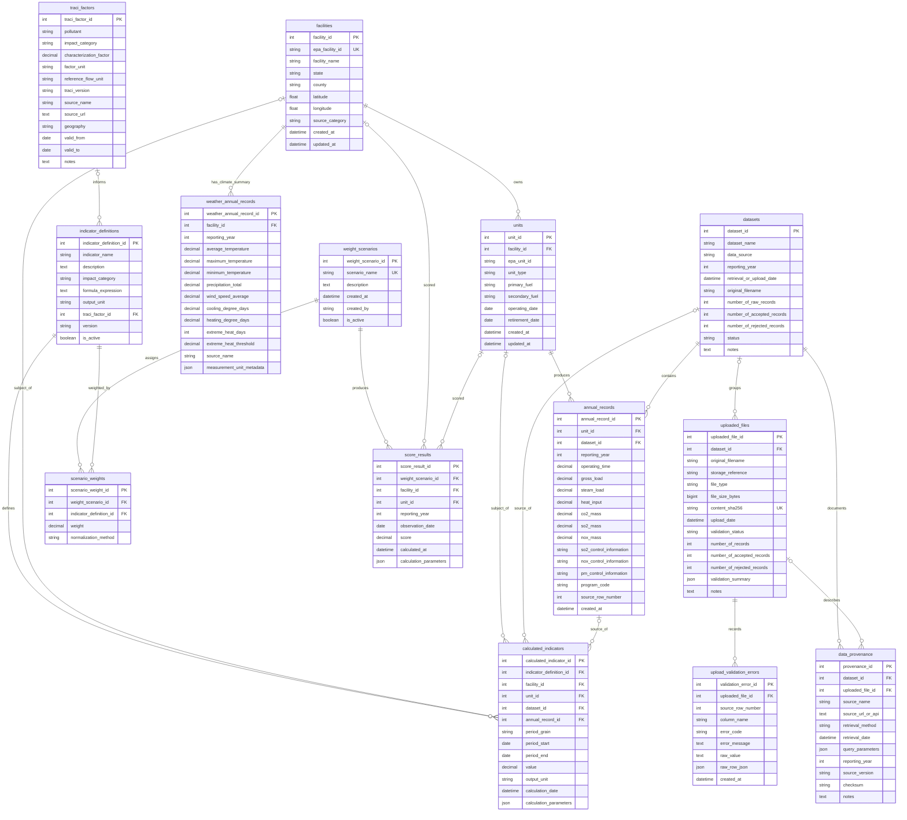

# epaData Database Schema

This design uses SQLite with SQLAlchemy ORM. Integer surrogate keys are used for internal relationships; EPA and TRACI identifiers remain stored as source identifiers. Measurements are stored in their source units and are not silently converted during import.

## Design decisions

- `facilities` and `units` are normalized master entities. A facility is not repeated in each observation.
- `annual_records` stores one unit/year observation for the current Phase 1 CAMPD model. `dataset_id` identifies the imported snapshot.
- A dataset is an import/retrieval snapshot, while `data_provenance` records how that snapshot was obtained.
- Upload validation is auditable: rejected rows and validation errors are retained in `upload_validation_errors`; invalid rows are never silently discarded.
- `traci_factors` is reference data and is joined during calculations. Factors are not copied into CAMPD observations.
- NASA POWER monthly regional data are requested from EPA facility coordinates and summarized to facility/year grain. CDD/HDD totals and extreme-heat-day counts retain their base temperature and threshold metadata.
- Annual CAMPD data cannot prove a daily relationship with weather. This schema stays at annual CAMPD grain and uses annual NASA POWER climate summaries for comparison.
- Relationships described as correlations, associations, or relationships must not be presented as causal conclusions without a causal analysis.

## Entity-relationship diagram

The diagram below is the maintained relationship overview for the schema. It uses Mermaid ER notation, which is rendered by GitHub and supported by many Markdown viewers. The table sections that follow remain the authoritative source for complete columns, constraints, indexes, and design notes.



Entity names match the SQLite / SQLAlchemy table names. `annual_records` holds unit/year operating and emissions metrics (`operating_time`, `gross_load`, `steam_load`, `heat_input`, `co2_mass`, `so2_mass`, `nox_mass`) plus control and program fields. `o|--o{` marks an optional foreign-key relationship used by polymorphic-style result rows: a calculated indicator or score result may target a facility, unit, or source record depending on its grain. `||--o{` marks a required parent for each child row.

## SQLAlchemy conventions

`DateTime(timezone=True)` is used for timestamps stored in UTC. `Date` is used for calendar dates. `Numeric(20, 6)` is preferred for measurements where precision matters; `Float` is acceptable for geographic coordinates and weather values where source precision varies. Boolean fields use `Boolean`. Every foreign key should use `ondelete="RESTRICT"` unless the relationship is explicitly an owned child such as validation errors.

## 1. `datasets`

**Purpose:** One logical retrieval or upload snapshot, including row counts and import status.

**Primary key:** `dataset_id` (`Integer`, non-null, identity).

**Columns:**

- `dataset_id`: `Integer`, non-null.
- `dataset_name`: `String(200)`, non-null.
- `data_source`: `String(100)`, non-null, e.g. `EPA CAMPD`, `NASA POWER`, `TRACI`.
- `reporting_year`: `Integer`, nullable when a dataset spans years; check `1900 <= value <= 2200` when present.
- `retrieval_or_upload_date`: `DateTime(timezone=True)`, non-null.
- `original_filename`: `String(255)`, nullable for API retrievals.
- `number_of_raw_records`: `Integer`, non-null, default `0`.
- `number_of_accepted_records`: `Integer`, non-null, default `0`.
- `number_of_rejected_records`: `Integer`, non-null, default `0`.
- `status`: `String(30)`, non-null, default `pending`; allowed values `pending`, `validated`, `imported`, `cancelled`, `failed`.
- `notes`: `Text`, nullable.

**Unique constraints:** `dataset_name` is not globally unique; two retrievals may have the same name. Use `uq_dataset_source_year_filename` on `(data_source, reporting_year, original_filename, retrieval_or_upload_date)` only if duplicate import prevention is required; otherwise use a content hash in `uploaded_files`.

**Indexes:** `(data_source, reporting_year)`, `retrieval_or_upload_date`, `status`.

**Relationships:** one-to-many with `annual_records`, `uploaded_files`, `data_provenance`, and future calculated results.

## 2. `facilities`

**Purpose:** One EPA CAMPD facility entity.

**Primary key:** `facility_id` (`Integer`, non-null, identity).

**Columns:**

- `facility_id`: `Integer`, non-null.
- `epa_facility_id`: `String(30)`, non-null.
- `facility_name`: `String(255)`, non-null.
- `state`: `String(2)`, non-null.
- `county`: `String(100)`, nullable.
- `latitude`: `Float`, nullable, check `-90 <= value <= 90`.
- `longitude`: `Float`, nullable, check `-180 <= value <= 180`.
- `source_category`: `String(100)`, nullable.
- `created_at`: `DateTime(timezone=True)`, non-null.
- `updated_at`: `DateTime(timezone=True)`, non-null.

**Foreign keys:** none.

**Unique constraints:** `uq_facility_epa_id` on `epa_facility_id`.

**Indexes:** `epa_facility_id` (unique), `(state, county)`, `facility_name`.

**Relationships:** one-to-many with `units` and `weather_annual_records`.

## 3. `units`

**Purpose:** A generating unit belonging to one facility.

**Primary key:** `unit_id` (`Integer`, non-null, identity).

**Columns:**

- `unit_id`: `Integer`, non-null.
- `facility_id`: `Integer`, non-null, FK to `facilities.facility_id`.
- `epa_unit_id`: `String(50)`, non-null.
- `unit_type`: `String(100)`, nullable.
- `primary_fuel`: `String(100)`, nullable.
- `secondary_fuel`: `String(100)`, nullable.
- `operating_date`: `Date`, nullable.
- `retirement_date`: `Date`, nullable. CAMPD facility attributes do not publish a retirement/end date (only `commercialOperationDate` and `operatingStatus`), so this column remains unused unless another source supplies it.
- `created_at`: `DateTime(timezone=True)`, non-null.
- `updated_at`: `DateTime(timezone=True)`, non-null.

**Unique constraints:** `uq_unit_facility_epa_unit` on `(facility_id, epa_unit_id)`.

**Indexes:** `(facility_id, epa_unit_id)` (unique), `unit_type`, `primary_fuel`.

**Relationships:** many-to-one with `facilities`; one-to-many with `annual_records`.

## 4. `annual_records`

**Purpose:** One accepted CAMPD unit observation for one reporting year and dataset.

**Primary key:** `annual_record_id` (`Integer`, non-null, identity).

**Columns:**

- `annual_record_id`: `Integer`, non-null.
- `unit_id`: `Integer`, non-null, FK to `units.unit_id`.
- `dataset_id`: `Integer`, non-null, FK to `datasets.dataset_id`.
- `reporting_year`: `Integer`, non-null, check `1900 <= value <= 2200`.
- `operating_time`: `Numeric(20, 6)`, nullable.
- `gross_load`: `Numeric(20, 6)`, nullable.
- `steam_load`: `Numeric(20, 6)`, nullable.
- `heat_input`: `Numeric(20, 6)`, nullable.
- `co2_mass`: `Numeric(20, 6)`, nullable.
- `so2_mass`: `Numeric(20, 6)`, nullable.
- `nox_mass`: `Numeric(20, 6)`, nullable.
- `so2_control_information`: `String(255)`, nullable.
- `nox_control_information`: `String(255)`, nullable.
- `pm_control_information`: `String(255)`, nullable.
- `program_code`: `String(100)`, nullable.
- `source_row_number`: `Integer`, nullable, for auditability.
- `created_at`: `DateTime(timezone=True)`, non-null.

**Foreign keys:** `unit_id -> units.unit_id`; `dataset_id -> datasets.dataset_id`.

**Unique constraints:** `uq_annual_unit_year_dataset` on `(unit_id, reporting_year, dataset_id)`. If the application permits only one canonical observation across all imports, replace this with `uq_annual_unit_year` on `(unit_id, reporting_year)` and retain superseded datasets outside the canonical table.

**Indexes:** `(reporting_year, unit_id)`, `(dataset_id, reporting_year)`, each common analysis measure as needed.

**Relationships:** many-to-one with `units` and `datasets`.

## 5. `traci_factors`

**Purpose:** Versioned TRACI characterization factors used to convert pollutant quantities into impact-category contributions.

**Primary key:** `traci_factor_id` (`Integer`, non-null, identity).

**Columns:**

- `traci_factor_id`: `Integer`, non-null.
- `pollutant`: `String(100)`, non-null, e.g. CO2, SO2, NOx.
- `impact_category`: `String(100)`, non-null, e.g. global warming, acidification.
- `characterization_factor`: `Numeric(30, 12)`, non-null.
- `factor_unit`: `String(100)`, non-null.
- `reference_flow_unit`: `String(100)`, nullable.
- `traci_version`: `String(50)`, non-null.
- `source_name`: `String(255)`, non-null.
- `source_url`: `Text`, nullable.
- `geography`: `String(100)`, nullable.
- `valid_from`: `Date`, nullable.
- `valid_to`: `Date`, nullable.
- `notes`: `Text`, nullable.

**Foreign keys:** none.

**Unique constraints:** `uq_traci_factor_version_pollutant_category` on `(traci_version, pollutant, impact_category, geography)`.

**Indexes:** `(impact_category, pollutant)`, `traci_version`.

**Relationships:** referenced by `indicator_definitions`; not copied into CAMPD records.

## 6. `uploaded_files`

**Purpose:** Immutable metadata for every submitted CSV or Excel file.

**Primary key:** `uploaded_file_id` (`Integer`, non-null, identity).

**Columns:**

- `uploaded_file_id`: `Integer`, non-null.
- `dataset_id`: `Integer`, nullable until approval, FK to `datasets.dataset_id`.
- `original_filename`: `String(255)`, non-null.
- `storage_reference`: `String(500)`, non-null.
- `file_type`: `String(20)`, non-null; allowed values `csv`, `xlsx`, `xls`.
- `file_size_bytes`: `BigInteger`, non-null, check `>= 0`.
- `content_sha256`: `String(64)`, non-null.
- `upload_date`: `DateTime(timezone=True)`, non-null.
- `validation_status`: `String(30)`, non-null, default `pending`; allowed values `pending`, `valid`, `invalid`, `approved`, `cancelled`, `imported`.
- `number_of_records`: `Integer`, non-null, default `0`.
- `number_of_accepted_records`: `Integer`, non-null, default `0`.
- `number_of_rejected_records`: `Integer`, non-null, default `0`.
- `validation_summary`: `JSON`, nullable; SQLite stores this as JSON text through SQLAlchemy.
- `notes`: `Text`, nullable.

**Unique constraints:** `uq_uploaded_content_hash` on `content_sha256` if identical files should not be imported twice.

**Indexes:** `content_sha256` (unique), `(validation_status, upload_date)`, `dataset_id`.

**Relationships:** many-to-one with `datasets`; one-to-many with `data_provenance` and `upload_validation_errors`.

## 7. `upload_validation_errors`

**Purpose:** Preserve every rejected row/field and validation reason so invalid data is not silently discarded.

**Primary key:** `validation_error_id` (`Integer`, non-null, identity).

**Columns:**

- `validation_error_id`: `Integer`, non-null.
- `uploaded_file_id`: `Integer`, non-null, FK to `uploaded_files.uploaded_file_id`.
- `source_row_number`: `Integer`, non-null.
- `column_name`: `String(255)`, nullable for row-level errors.
- `error_code`: `String(50)`, non-null, e.g. `missing_required_column`, `invalid_value`, `duplicate_key`.
- `error_message`: `Text`, non-null.
- `raw_value`: `Text`, nullable.
- `raw_row_json`: `JSON`, nullable, for the original row snapshot.
- `created_at`: `DateTime(timezone=True)`, non-null.

**Foreign keys:** `uploaded_file_id -> uploaded_files.uploaded_file_id`.

**Unique constraints:** `uq_validation_error_location` on `(uploaded_file_id, source_row_number, column_name, error_code)`.

**Indexes:** `(uploaded_file_id, source_row_number)`, `error_code`.

**Relationships:** many-to-one with `uploaded_files`.

## 8. `data_provenance`

**Purpose:** Record source, retrieval/import method, parameters, and lineage for a dataset or file.

**Primary key:** `provenance_id` (`Integer`, non-null, identity).

**Columns:**

- `provenance_id`: `Integer`, non-null.
- `dataset_id`: `Integer`, non-null, FK to `datasets.dataset_id`.
- `uploaded_file_id`: `Integer`, nullable, FK to `uploaded_files.uploaded_file_id`.
- `source_name`: `String(255)`, non-null.
- `source_url_or_api`: `Text`, nullable.
- `retrieval_method`: `String(50)`, non-null, e.g. `API`, `download`, `user_upload`.
- `retrieval_date`: `DateTime(timezone=True)`, non-null.
- `query_parameters`: `JSON`, nullable.
- `reporting_year`: `Integer`, nullable.
- `source_version`: `String(100)`, nullable.
- `checksum`: `String(128)`, nullable.
- `notes`: `Text`, nullable.

**Foreign keys:** `dataset_id -> datasets.dataset_id`; `uploaded_file_id -> uploaded_files.uploaded_file_id`.

**Unique constraints:** none; multiple provenance events may describe transformations.

**Indexes:** `dataset_id`, `uploaded_file_id`, `(source_name, retrieval_date)`.

**Relationships:** many-to-one with `datasets` and optionally `uploaded_files`.

## 9. `weather_annual_records`

**Purpose:** One annual NASA POWER climate summary for one EPA facility. This is the active weather grain used by the project to retain annual temperature, precipitation, wind, degree-day, and extreme-heat metrics without storing daily observations.

**Primary key:** `weather_annual_record_id` (`Integer`, non-null, identity).

**Columns:**

- `weather_annual_record_id`: `Integer`, non-null.
- `facility_id`: `Integer`, non-null, FK to `facilities.facility_id`.
- `reporting_year`: `Integer`, non-null.
- `average_temperature`: `Numeric(10, 3)`, nullable; mean daily temperature in C.
- `maximum_temperature`: `Numeric(10, 3)`, nullable; annual maximum daily temperature in C.
- `minimum_temperature`: `Numeric(10, 3)`, nullable; annual minimum daily temperature in C.
- `precipitation_total`: `Numeric(14, 4)`, nullable; annual total in mm.
- `wind_speed_average`: `Numeric(10, 3)`, nullable; annual mean in m/s.
- `cooling_degree_days`: `Numeric(12, 3)`, nullable; annual total using an 18.3 C base.
- `heating_degree_days`: `Numeric(12, 3)`, nullable; annual total using an 18.3 C base.
- `extreme_heat_days`: `Integer`, non-null; count of days with TMAX at or above 35 C.
- `extreme_heat_threshold`: `Numeric(10, 3)`, nullable.
- `source_name`: `String(100)`, non-null; `NASA POWER` for the active importer.
- `measurement_unit_metadata`: `JSON`, nullable; includes facility coordinates, selected NASA grid coordinates, units, resolution, and degree-day base.

**Unique constraints:** `uq_weather_facility_year` on `(facility_id, reporting_year)`.

**Relationships:** many-to-one with `facilities`.

## 10. `indicator_definitions`

**Purpose:** Definitions of calculated environmental indicators, including formula and units.

**Primary key:** `indicator_definition_id` (`Integer`, non-null, identity).

**Columns:** `indicator_definition_id` (`Integer`, non-null), `indicator_name` (`String(150)`, non-null), `description` (`Text`, nullable), `impact_category` (`String(100)`, nullable), `formula_expression` (`Text`, non-null), `output_unit` (`String(100)`, non-null), `traci_factor_id` (`Integer`, nullable, FK), `version` (`String(50)`, non-null), `is_active` (`Boolean`, non-null, default `True`).

**Unique constraints:** `(indicator_name, version)`.

**Indexes:** `impact_category`, `is_active`.

**Relationships:** optionally references `traci_factors`; one-to-many with `calculated_indicators` and `score_results`.

## 11. `calculated_indicators`

**Purpose:** Persist calculated indicator values and the exact source records used.

**Primary key:** `calculated_indicator_id` (`Integer`, non-null, identity).

**Columns:** `calculated_indicator_id` (`Integer`, non-null), `indicator_definition_id` (`Integer`, non-null, FK), `annual_record_id` (`Integer`, nullable, FK), `calculation_date` (`DateTime(timezone=True)`, non-null), `value` (`Numeric(30, 12)`, non-null), `output_unit` (`String(100)`, non-null), `calculation_parameters` (`JSON`, nullable).

The implementation also includes nullable `facility_id`, `unit_id`, and `dataset_id` foreign keys, plus `period_grain`, `period_start`, and `period_end`. These fields allow an indicator to represent a unit-level annual value, a facility-level monthly aggregate, or a weather summary without copying source observations.

Useful `indicator_name` definitions include `CO2 per MWh`, `SO2 per MWh`, `NOx per MWh`, TRACI global-warming/acidification/eutrophication/smog impacts, `average temperature`, `CDD`, `HDD`, `extreme heat day count`, `coal generation share`, and `natural gas generation share`.

**Constraints:** at least one source or subject (`annual_record_id`, `facility_id`, or `unit_id`) must be non-null; `period_end >= period_start`. Keep the calculation formula, input units, base temperature, extreme-heat threshold, and source dataset IDs in `calculation_parameters`.

**Indexes:** `(indicator_definition_id, calculation_date)`, `annual_record_id`.

**Relationships:** many-to-one with `indicator_definitions` and one source observation.

## 12. `weight_scenarios`

**Purpose:** Named weighting scenarios for combining normalized indicators.

**Primary key:** `weight_scenario_id` (`Integer`, non-null, identity).

**Columns:** `weight_scenario_id` (`Integer`, non-null), `scenario_name` (`String(150)`, non-null), `description` (`Text`, nullable), `created_at` (`DateTime(timezone=True)`, non-null), `created_by` (`String(150)`, nullable), `is_active` (`Boolean`, non-null, default `True`).

**Unique constraints:** `scenario_name`.

**Indexes:** `is_active`.

**Relationships:** one-to-many with `scenario_weights` and `score_results`.

## 13. `scenario_weights`

**Purpose:** The weight assigned to each indicator in a scenario.

**Primary key:** `scenario_weight_id` (`Integer`, non-null, identity).

**Columns:** `scenario_weight_id` (`Integer`, non-null), `weight_scenario_id` (`Integer`, non-null, FK), `indicator_definition_id` (`Integer`, non-null, FK), `weight` (`Numeric(18, 8)`, non-null, check `weight >= 0`), `normalization_method` (`String(100)`, nullable).

**Unique constraints:** `(weight_scenario_id, indicator_definition_id)`.

**Indexes:** `weight_scenario_id`, `indicator_definition_id`.

**Relationships:** many-to-one with `weight_scenarios` and `indicator_definitions`.

## 14. `score_results`

**Purpose:** Persist a score produced by a weighting scenario for an explicit subject and period.

**Primary key:** `score_result_id` (`Integer`, non-null, identity).

**Columns:** `score_result_id` (`Integer`, non-null), `weight_scenario_id` (`Integer`, non-null, FK), `facility_id` (`Integer`, nullable, FK), `unit_id` (`Integer`, nullable, FK), `reporting_year` (`Integer`, nullable), `observation_date` (`Date`, nullable), `score` (`Numeric(30, 12)`, non-null), `calculated_at` (`DateTime(timezone=True)`, non-null), `calculation_parameters` (`JSON`, nullable).

**Constraints:** at least one subject (`facility_id` or `unit_id`) must be non-null; use a check constraint. Require either `reporting_year` or `observation_date` according to the result grain.

**Indexes:** `(facility_id, reporting_year)`, `(unit_id, observation_date)`, `weight_scenario_id`.

**Relationships:** many-to-one with `weight_scenarios`, optionally `facilities` and `units`.

## Import and analysis workflow

1. Create `uploaded_files` and a pending `datasets` row.
2. Validate extension, size, encoding/sheet, required columns, nulls, domains, and duplicate `(facility, unit, year)` keys with pandas.
3. Write every problem to `upload_validation_errors`; show counts and a preview of accepted and rejected rows.
4. Require explicit approval. On cancellation, keep metadata and validation errors but import no observations.
5. Upsert normalized facilities and units, then insert accepted observations into `annual_records` inside one transaction.
6. Mark the dataset and upload `imported` only after the transaction succeeds.
7. For weather analysis, use the NASA POWER annual summary for the facility and requested year; never infer daily emissions from annual totals.
8. Download results as CSV from explicit queries, including dataset/provenance identifiers and units.

## Recommended SQLAlchemy relationship summary

- `Dataset.annual_records`, `Dataset.uploaded_files`, `Dataset.provenance`
- `Facility.units`, `Facility.weather_annual_records`
- `Unit.annual_records`
- `WeatherAnnualRecord.facility`
- `UploadedFile.validation_errors`
- `IndicatorDefinition.calculated_indicators`, `WeightScenario.weights`, `WeightScenario.score_results`

Use `relationship(..., cascade="all, delete-orphan")` only for owned child records such as `upload_validation_errors`; do not cascade-delete source observations when a facility or dataset is removed. Prefer status/supersession flags for source data retention.

## Implementation guide

### 1. Recommended overall data architecture

Use four small layers:

1. **Raw intake and provenance:** `uploaded_files`, `upload_validation_errors`, `datasets`, and `data_provenance`.
2. **Normalized observations:** `facilities`, `units`, `annual_records`, and `weather_annual_records`.
3. **Reference and derived evaluation:** `traci_factors`, `indicator_definitions`, and `calculated_indicators`.
4. **Scenario evaluation:** `weight_scenarios`, `scenario_weights`, and `score_results`.

Pandas should handle file parsing and validation. SQLAlchemy should handle transactional imports and application queries. Keep uploaded files outside SQLite and store only a controlled `storage_reference`, SHA-256 hash, and metadata in the database.

### 2. Recommended climate product

Use **NASA POWER monthly regional data** for the active climate implementation. It provides 1981-present monthly meteorological time series on NASA POWER's native regional grid, including temperature, precipitation, and wind. The importer requests that grid in 10-degree tiles and maps each EPA facility coordinate to its nearest grid point, avoiding one point request per facility and the API's 300-request quota. Store source units and convert to a project display unit only in the analysis layer.

For each import, record the NASA POWER endpoint, requested parameters, facility coordinates, retrieval date, selected grid coordinates, source resolution, and conversion metadata. Annual summaries use the `(facility_id, reporting_year)` key.

### 3. Complete entity/relationship overview

```text
facilities 1---* units 1---* annual_records *---1 datasets
    |                              |
    +---* weather_annual_records   +---* uploaded_files 1---* upload_validation_errors
    |                              +---* data_provenance
    |
    +---o calculated_indicators / score_results (optional subjects)

annual_records metrics:
  operating_time, gross_load, steam_load, heat_input,
  co2_mass, so2_mass, nox_mass,
  so2_control_information, nox_control_information, pm_control_information,
  program_code

units attributes:
  unit_type, primary_fuel, secondary_fuel, operating_date, retirement_date

traci_factors o---* indicator_definitions 1---* calculated_indicators
indicator_definitions 1---* scenario_weights *---1 weight_scenarios 1---* score_results
calculated_indicators optionally reference facility, unit, dataset, and/or annual_record
```

### 4. Complete table-by-table schema

The complete table-by-table specification is in sections 1-14 above. The executable SQLAlchemy version is [models.py](models.py). It uses the same table names, columns, foreign keys, constraints, relationships, and indexes.

### 5. Primary keys and foreign keys

Each table has an integer surrogate primary key. External identifiers remain separately constrained: EPA facility IDs are unique in `facilities`, EPA unit IDs are unique within a facility, and uploaded content hashes can prevent duplicate imports. Foreign keys preserve the chain from annual observations and climate summaries to units, facilities, datasets, and provenance.

### 6. Unique constraints

The important business keys are:

- `facilities.epa_facility_id`
- `(units.facility_id, units.epa_unit_id)`
- `(annual_records.unit_id, reporting_year, dataset_id)`
- `(weather_annual_records.facility_id, reporting_year)`
- `(indicator_definitions.indicator_name, version)`
- `(scenario_weights.weight_scenario_id, indicator_definition_id)`

The annual key intentionally includes `dataset_id` so a new source snapshot can be retained. A deployment that permits only one canonical annual observation should add a canonical/superseded policy and enforce `(unit_id, reporting_year)` for that canonical table.

### 7. Recommended indexes and search strategy

The model indexes the high-value filters directly: EPA IDs, facility name, state/county, fuels, unit type, reporting year, dataset/year, emissions, operating time, load, heat input, facility/year weather summaries, temperatures, CDD, and extreme-heat status. Composite indexes follow the common leading predicates, such as `(reporting_year, unit_id)` and `(facility_id, reporting_year)`.

For SQLite, ordinary B-tree indexes support equality and range filters such as `co2_mass >= :minimum` and `gross_load BETWEEN :low AND :high`. Top-N and bottom-N queries should use `ORDER BY ... DESC/ASC LIMIT :n`; group-and-rank queries should aggregate first and use a window function such as `DENSE_RANK()` when the SQLite version supports it. Do not index every nullable measurement automatically; add an index after a query is demonstrated to need it.

### 8. How CAMPD, weather, and TRACI relate

- CAMPD observations provide facility/unit operating and emissions measures.
- `weather_annual_records` provides facility/year NASA POWER summaries for comparison with annual CAMPD.
- TRACI factors remain versioned reference data. An indicator definition selects the relevant factor, and a calculation applies it to pollutant quantities. Factors are not duplicated into annual or weather rows.
- All weather findings should be reported as associations or correlations unless a separate causal design is performed.

### 9. Annual climate data handling

Keep `annual_records` and `weather_annual_records` at year grain. Join annual weather directly through `facility_id` and compare mean temperature, maximum temperature, total precipitation, total CDD, total HDD, and extreme-heat-day counts by facility/year.

`weather_annual_records` is populated from NASA POWER monthly values, and `calculated_indicators` may cache a further annual aggregate when it is expensive or repeatedly displayed.

### 10. CDD, HDD, and extreme heat

Calculate CDD and HDD from NASA POWER monthly mean temperatures using an explicitly documented base temperature, normally 65 F (18.3 C), weighting the monthly values to an annual equivalent. Store annual totals in `weather_annual_records` with the base temperature, source resolution, and units in `measurement_unit_metadata`.

Extreme heat should be a derived classification, not a raw source fact. Store `extreme_heat_days` and `extreme_heat_threshold` only when the threshold is known. A percentile threshold by point and reference period is preferable for cross-climate comparisons; a fixed threshold is simpler for Phase 2.

### 11. SQLAlchemy model code

The complete declarative model implementation is [models.py](models.py). It defines `Base`, all 14 entities, typed relationships, `ForeignKey`, `UniqueConstraint`, `CheckConstraint`, and `Index` declarations, plus `initialize_database()` for a course-project bootstrap.

### 12. Example queries

The following examples use SQLAlchemy 2.x and the models in [models.py](models.py):

```python
from sqlalchemy import desc, func, select

# Search by facility, state, year, fuel, and emissions range.
query = (
	select(Facility, Unit, AnnualRecord)
	.join(Facility.units)
	.join(Unit.annual_records)
	.where(
		Facility.state == "OH",
		Facility.facility_name.ilike("%river%"),
		Unit.primary_fuel == "Coal",
		AnnualRecord.reporting_year.between(2018, 2022),
		AnnualRecord.co2_mass >= 100000,
	)
)

# Top-N facilities by CO2 in a reporting year.
top_n = (
	select(Facility.facility_name, func.sum(AnnualRecord.co2_mass).label("co2_total"))
	.join(Facility.units)
	.join(Unit.annual_records)
	.where(AnnualRecord.reporting_year == 2022)
	.group_by(Facility.facility_id, Facility.facility_name)
	.order_by(desc("co2_total"))
	.limit(10)
)

# Group and rank fuel totals.
fuel_totals = (
	select(Unit.primary_fuel, func.sum(AnnualRecord.gross_load).label("load_total"))
	.join(Unit.annual_records)
	.where(AnnualRecord.reporting_year == 2022)
	.group_by(Unit.primary_fuel)
	.order_by(desc("load_total"))
)

```

For annual CAMPD plus climate, join `WeatherAnnualRecord` to `AnnualRecord.reporting_year` through `facility_id`. Compare groups with explicit sample sizes and missing-data rules. Calculate CO2/MWh only when the denominator is present and nonzero; never replace a missing or zero gross load with an arbitrary value.

### 13. Recommended database initialization and Week 2 steps

Use `Base.metadata.create_all()` only for the first local prototype. Add Flask-Migrate/Alembic before importing coursework data that must survive schema changes. A practical structure is:

```text
epaData/
  app/
	__init__.py
	models.py
	routes.py
	services/
	  validation.py
	  imports.py
	  analysis.py
  migrations/
  tests/
  instance/epa_data.db
```

Recommended Week 2 sequence:

1. Create the Flask application factory, SQLite configuration, SQLAlchemy session, and migration setup.
2. Run the model smoke test against in-memory SQLite and add fixtures for one facility, unit, annual record, and weather record.
3. Implement CSV/XLSX extension and file-size checks, pandas loading, required-column checks, type/domain checks, null checks, and duplicate-key checks.
4. Persist an upload preview and `upload_validation_errors`; require approval before inserting accepted facilities, units, and annual records.
5. Add indexed facility/unit/year/fuel/emissions search and CSV download.
6. Import a small NASA POWER sample, calculate CDD/HDD with documented units, and test a facility annual climate summary.
7. Add pytest coverage for rejected rows, duplicate prevention, rollback on failed import, range filters, and the annual weather aggregation boundary.
